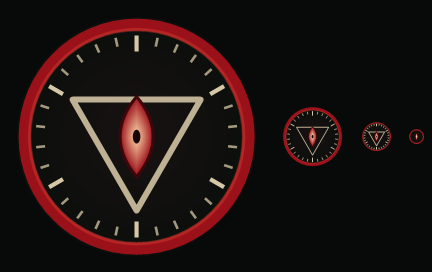
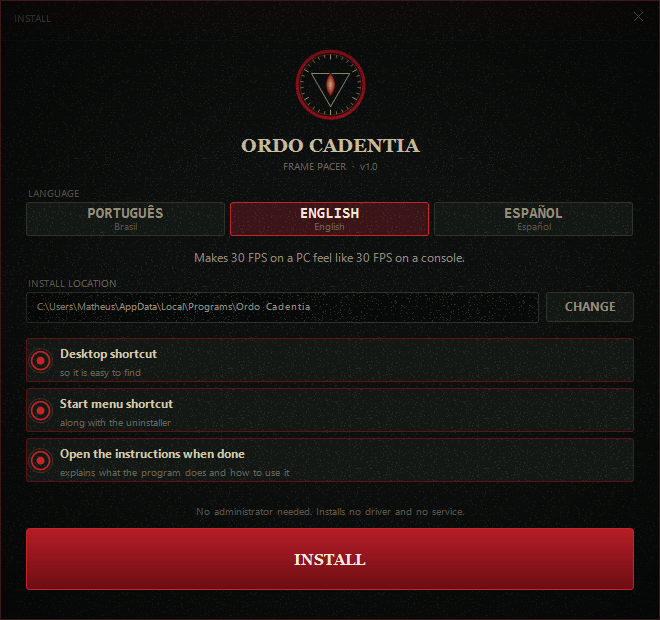
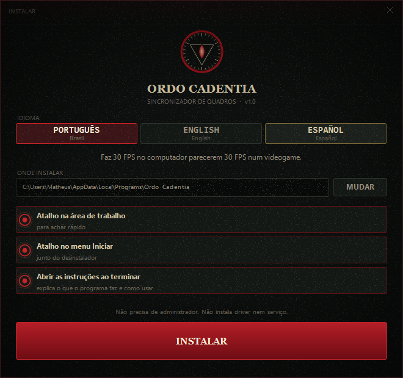
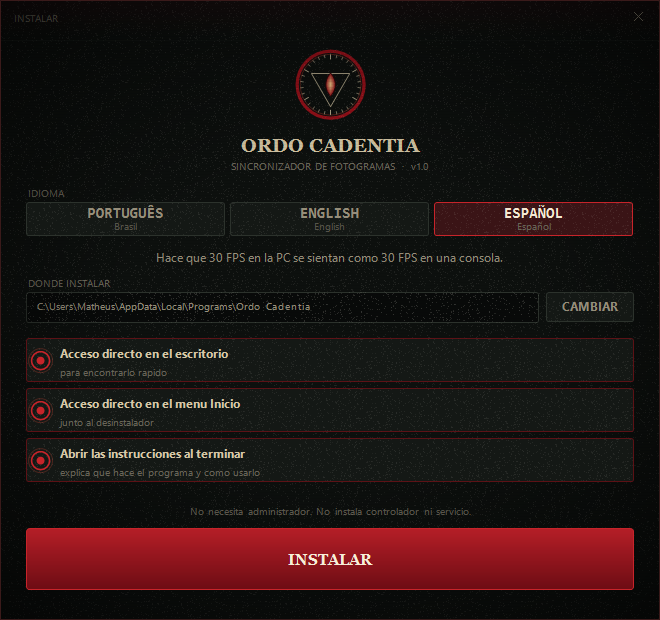

<div align="center">



# Ordo Cadentia

### Makes 30 FPS on a PC feel like 30 FPS on a console.

**Free · Windows 10 and 11 · Nothing else to install · Available in English, Português and Español**

</div>

---

## The problem, in one minute

You have probably noticed this: a game running at 30 FPS on a console looks
fine, but the same 30 FPS on a PC looks broken and stuttery.

That is not your imagination, and it is **not your graphics card**. It is a
division problem, and it is easy to see once someone points at it.

Your monitor does not show a new picture whenever the game feels like it. It
refreshes on a fixed beat — a "60 Hz" monitor refreshes 60 times a second, a
"165 Hz" monitor refreshes 165 times a second. A new frame can only appear on
one of those beats. Never in between.

So the whole thing comes down to one division:

> **How many monitor refreshes does each frame get to wait?**

If the answer is a **whole number**, every frame waits exactly the same amount
of time and the motion looks smooth. If it is **not** a whole number, frames
wait an uneven amount — one a little short, the next a little long — and your
eye reads that unevenness as stutter.

| | The division | What each frame waits | How it looks |
|---|---|---|---|
| Console on a 60 Hz TV | 60 ÷ 30 = **2** | 2, 2, 2, 2, 2… | **Smooth** |
| PC on a 165 Hz monitor | 165 ÷ 30 = **5.5** | 5, 6, 5, 6, 5, 6… | **Stutters** |
| PC on a 144 Hz monitor | 144 ÷ 30 = **4.8** | 5, 5, 4, 5, 5… | **Stutters** |
| Same PC forced to 120 Hz | 120 ÷ 30 = **4** | 4, 4, 4, 4, 4… | **Smooth** |

The console is not better. It is just luckier: its TV runs at 60 Hz and the game
is capped at 30, and 60 ÷ 30 is a whole number. That is the entire trick.

Your 165 Hz monitor is a *better* monitor than that TV — but 165 is an awkward
number to divide by 30.

**Ordo Cadentia switches your monitor to a number that divides evenly while you
play, and puts it back exactly how it was when you are done.**

---

## What it does

### It locks your monitor's refresh rate

It checks your monitor, shows you every refresh rate it can actually do — from
60 Hz up to its maximum — and holds it at whichever one you pick. If something
else tries to change it while you play, the program notices and changes it back.

You do not need to choose a game for this. It works on its own if you just want
your monitor to stay at a certain setting.

### It tunes Windows around one game

You point it at your game's window, and it applies up to six adjustments:

| Adjustment | In plain words |
|---|---|
| **Sync the display** | The big one. Puts your monitor on a refresh rate that divides evenly into your game's frame rate. This is what stops the stutter. |
| **Sharpen the timer** | Asks Windows to keep time more precisely, so frame limiters hit their target more accurately. |
| **High priority** | Tells Windows to serve your game before other programs. |
| **Performance cores** | On newer Intel chips, keeps the game off the slower "efficiency" cores, where sudden hitches come from. |
| **Turn off fullscreen optimizations** | Removes an extra Windows layer that often makes pacing worse. |
| **Quiet background programs** | Turns down your browser, Discord and similar while you play. It does not close anything. |

**Everything it changes, it changes back.** Close the program and your system
returns to normal — even if it crashes, because it leaves a note on disk so it
can undo the change the next time it opens.

---

## What it does **not** do

This is the most important section, so it is not buried at the bottom.

> ### It does not cap your game at 30 FPS. You do that part.

To force a frame cap onto a game, a program has to reach inside the game while
it runs. That is how tools like RivaTuner work — and it is exactly the sort of
thing that anti-cheat systems treat as an attack, which can get accounts banned.

**Ordo Cadentia never touches your game.** It does not read or change anything
inside it. It only changes settings that belong to Windows itself: the monitor's
refresh rate, the system timer, and how Windows schedules programs.

So the work is split:

| You do this | Ordo Cadentia does this |
|---|---|
| Cap the game at 30 FPS — in the game's own settings menu, in your NVIDIA or AMD control panel, or with RivaTuner | Makes those 30 frames land on your screen at perfectly even intervals |

That second half is the half that fixes the stuttery feeling. A game capped at
30 with a mismatched monitor will still stutter, no matter how good the cap is.

It also does **not** increase your FPS, does **not** improve graphics quality,
and will **not** rescue a game that runs badly because the hardware cannot keep
up.

---

## How to use it

1. **Cap your game at the frame rate you want.** Look for "FPS limit" in the
   game's own options, or use your graphics card's control panel.
2. **Turn on VSync in the game.** Without it, none of this works.
3. **Open Ordo Cadentia and pick your game's window** from the list.
4. **Type in the same frame rate** you capped the game at.
5. **Look at the Before and After panel.** Each block is one frame, and how wide
   the block is shows how long that frame stays on screen. Uneven blocks are the
   stutter you have been seeing. Even blocks are what you want.
6. **Click Activate**, then minimize the window and go play.

When you are done, click Deactivate — or just close the program.

### If you use frame generation (DLSS FG, FSR FG, AFMF)

Frame generation invents extra frames, so what reaches your monitor is not what
the game actually draws. If the game draws 30 and frame generation doubles it,
your monitor receives **60**.

That changes the division, so the program has a setting for it right on the main
screen. Set it correctly or the math comes out wrong.

One honest warning: frame generation makes the picture look smoother, but it
does **not** make the game respond faster. Your eyes are fooled; your hands are
not.

---

## Installing

<div align="center">

| | | |
|:--:|:--:|:--:|
|  |  |  |
| English | Português | Español |

</div>

1. Go to the **[Releases](../../releases)** page and download
   `Instalar-OrdoCadentia.exe`.
2. Run it. Pick your language, click Install.

It does not ask for administrator permission, and it does not install any
drivers, services or background tasks. It does not start with Windows, and it
never connects to the internet.

To remove it: Start menu → Ordo Cadentia → Uninstall, or through Windows
Settings → Apps, like any other program. The uninstaller cleans up after itself
completely.

> **A note about your antivirus.** These files are not digitally signed, and the
> program does three things antivirus software is trained to be suspicious of: it
> changes your display settings, it changes how Windows prioritises programs, and
> the uninstaller deletes itself. None of that is harmful, but the pattern can
> look similar, so you may get a warning.

> **A note about administrator permission.** The installer does not need it. The
> program itself asks for it when it opens, because games with anti-cheat run
> with elevated permissions, and without matching permissions two of the six
> adjustments cannot reach them.

---

## Questions people ask

**"My monitor has no refresh rate that divides into 30."**
This happens on some 144 Hz monitors with no 120 or 60 option (144 ÷ 30 = 4.8).
The program picks the least-bad option and tells you honestly that it is not
perfect. You could also play at 24 or 48 FPS, which do divide evenly on a 144 Hz
monitor.

**"My screen blinks when I turn it on."**
That is normal — changing a monitor's refresh rate always blanks the screen for
a moment, the same as changing resolution.

**"Something crashed and my monitor was left on the wrong setting."**
Just open the program again. It fixes that automatically on startup.

**"The game is in fullscreen and nothing happens."**
In true "exclusive fullscreen" mode, the game controls your display instead of
Windows. Switch the game to **borderless windowed** mode, or lock the refresh
rate before you open the game.

**"Can this get me banned?"**
The program never touches the game. It uses the same Windows features that Task
Manager uses to change priorities and that the Windows Settings panel uses to
change refresh rates. That said, the final decision always belongs to each
game's own anti-cheat.

---

## For developers

<details>
<summary>Building from source, project layout, and tests</summary>

### Requirements

Windows 10 or 11 and the .NET SDK 6 or newer — used only for its Roslyn
compiler. There is no Visual Studio requirement, no NuGet restore and no project
files.

The build links against the .NET Framework 4.x libraries that ship with every
Windows install, which is why the binaries are small (the whole program is about
186 KB) and run anywhere without a runtime download.

```powershell
.\build.ps1           # builds everything into dist\
.\build.ps1 -Tests    # builds, then runs the full test suite
```

Builds are **deterministic**: the same source always produces a byte-identical
binary, so you can verify by hash whether an installed copy matches a given
commit.

### Tests

The suite touches the real system — expect the screen to blink a few times as
refresh rates are changed and restored.

- **LanguageTest** — walks the string table by reflection and checks that all
  247 phrases exist in all three languages, that none are blank, that none were
  left untranslated, and that `{0}` placeholders match across languages.
- **SelfTest** — the pacing arithmetic, display mode enumeration, P/E core
  detection, timer resolution, and compatibility-flag registry handling.
- **EndToEndTest** — end to end. Opens a real target window, applies everything,
  verifies the system actually changed, then verifies **everything is restored**.
  Covers the refresh rate lock, the watchdog that restores the rate after
  external interference, and the precedence rules between a manual lock and
  automatic syncing. It backs up and restores your own settings file, so running
  it does not disturb your configuration.

### Layout

```
src/OrdoCadentia/        the program
  Native.cs              Windows API layer
  Platform.cs            pacing math, display, timer, CPU topology, targeting
  Engine.cs              orchestration, persistence, watchdog, undo
  Strings.cs             every user-visible string, in all three languages
  Theme.cs               palette, typography, textures
  Controls.cs            hand-drawn controls
  PacingMeter.cs         the before/after frame strip
  Dialogs.cs             window picker
  MainWindow.cs          main window
  Program.cs             entry point

src/Installer/           installer (carries the others inside it)
src/Uninstaller/         uninstaller
src/Tools/               icon generator, tests, screenshot tool
resources/               LEIA-ME.txt · README.txt · LEEME.txt
build.ps1                build script
```

Every user-facing string lives in `Strings.cs` and is translated into English,
Portuguese and Spanish. The uninstaller keeps its Portuguese filename
(`Desinstalar.exe`) because copies already installed reference it by that name
in the Windows uninstall registry entry.

### Adding a language

Add a value to the `Language` enum, extend the `Pick(pt, en, es)` helper in
`Strings.cs`, and add your translations. `LanguageTest` will tell you if you
missed any.

</details>

---

## Licence

This repository has no licence file yet. Without one, the default applies: all
rights reserved, and nobody may legally use, copy or modify the code. If you
want to let other people use it, add a `LICENSE` file —
[MIT](https://choosealicense.com/licenses/mit/) is the usual choice for a
project like this.

---

<div align="center">
<sub>Frames at even intervals, just like a console.</sub>
</div>
